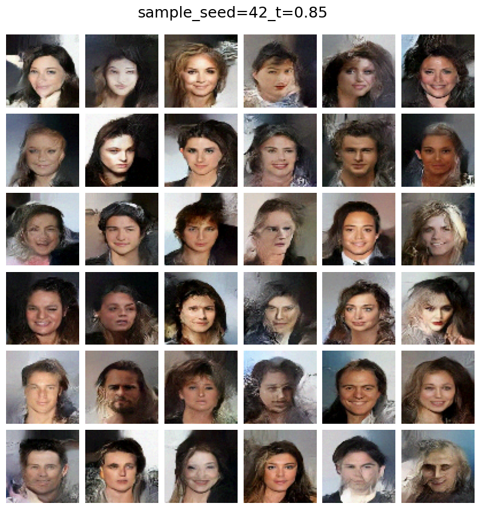
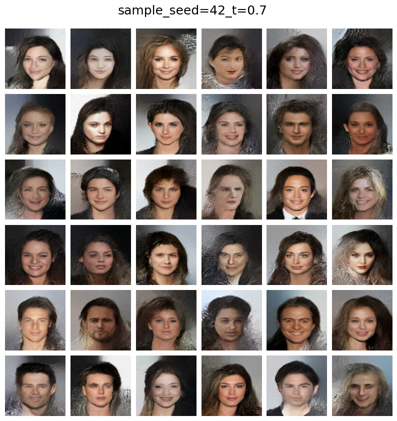

# Glow generative model in jax

An implementation of the [Glow generative model](https://arxiv.org/pdf/1807.03039.pdf) in `jax`, and using the high-level API `flax`. Glow is a reversible generative model, based on the variational auto-encoder framework with normalizing flows.
The notebook can also be found on [kaggle](https://www.kaggle.com/ameroyer/introduction-to-glow-generative-model-in-jax), where it was trained on a subset of the aligned [CelebA](http://mmlab.ie.cuhk.edu.hk/projects/CelebA.html) dataset.


### Setup

#### Dependencies
```bash
pip install jax jaxlib
pip install flax
```

#### Sample from the model

Random samples can be generated as follows; Here for instance for generating 16 samples with sampling temperature 0.7 and setting the random seed to 0:

```bash
python3 sample.py 16 -t 0.7 -s 0 --model_path [path]
```


### Example
A pretrained model can be found in the [kaggle notebook's outputs](https://www.kaggle.com/ameroyer/introduction-to-glow-generative-model-in-jax).

**Note**: The model was only trained for roughly 13 epochs due to computation limits. Compared to the original model, it also uses ashallower flow (`K = 16` flow steps per scale)

#### Example results - training evolution


#### Example results - sampling





#### Example results - linear interpolation

